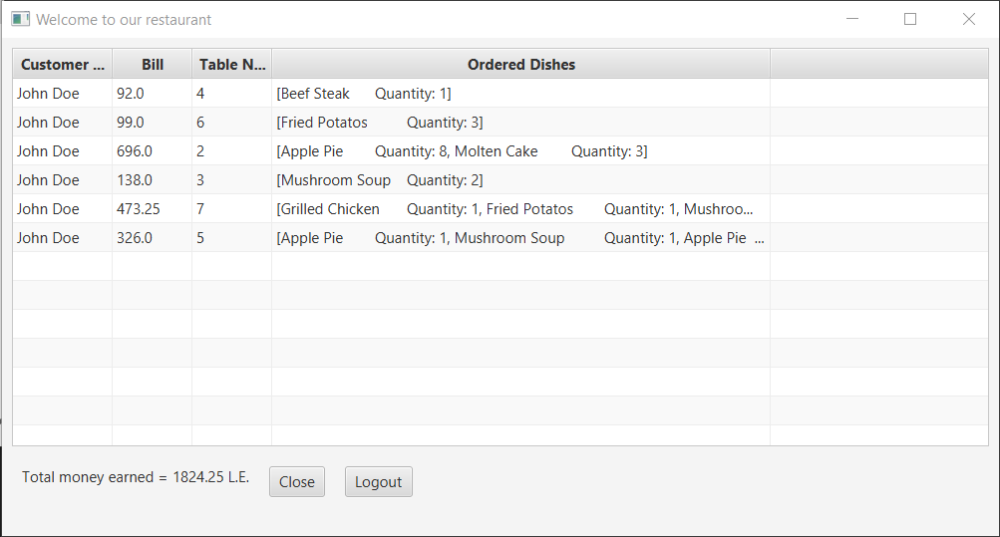
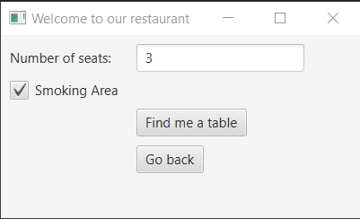
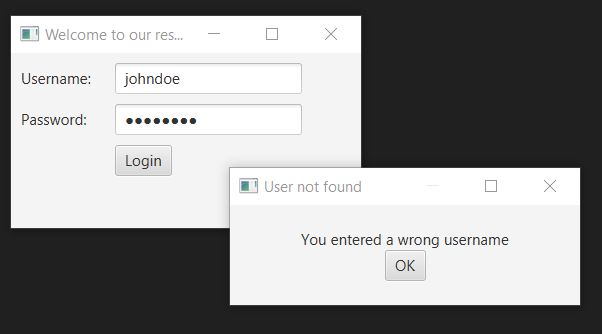
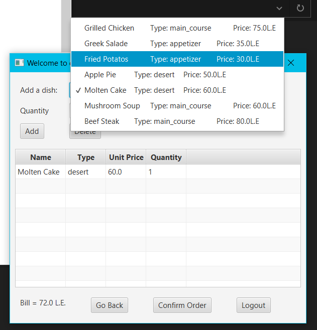
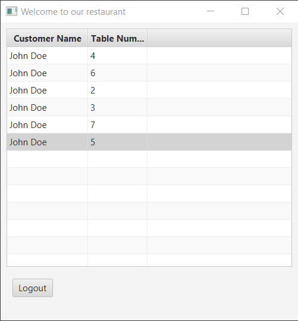

# Restaurant Management System
## Users
- Manager
- Staff
    - Cook
    - Waiter
- Customer

## Features
- Manager
    - View summary of activity for the day.
    - View total revenue.
- Staff
    - Cook
        - View orders
    - Waiter
        - View reservation information
            - Table number
            - Number of seats
            - Order details
            - Bill
    - Customer
        - Browse the menu
        - Make reservations
        - Choose between smoking and non-smoking areas
        - Place an order
        - View the bil.
- Username and password authorization for all users
- Protection of information
- Highly user-friendly GUI.

## Screenshots
- 
- 
- 
- 
- 
- 
- 
------------------------------------------------
## Design

### Assumptions and important notes:

* when a client reserves a table it's declared as not free and the data of the restaurant tables in the input XML file is changed, so when the table is searched for later it becomes unavailable.

* when a client searches for a table with a specific number of seats, the program searches for a table with that number or up to 2 more seats.

* the file names are declared in an Enum called *Files* . The data of the restaurant is updated after each reservation as mentioned in the first note. The reservation data is saved in details in a different XML file.

* the project is designed according to the **MVC (Model-View-Controller)** convention. The *Main* class is the **Controller**.

##  Division of labor:

   * What we both modified:
    
        i. The login GUI (in the **View**)
        
        ii. The login algorithm (in the **Model** and the **Controller**(Main))
        
        iii. Loading data from the XML files.
        
        
* ***Nourhan Waleed***'s Work (6609):
    
    i. The Waiter's scene in the **View**.
    
    ii. The Cook's scene in the **View**.
    
    iii. The Waiter's handling algorithm (in the **Controller**)
    
    iv. The Cook's handling algorithm (in the **Controller**)
    
    v. Use Case Diagram (not in the project files but is essential in designing and analysis)
    
* ***Fatema Moharam***'s Work (6655):

    i. The **Model** interface and its sub-classes (Person, Client & Employee).
    
    ii. The Reservation-related classes, methods & XML file.
    
    iii. The Client and the Manager scenes in the **View**.
    
    iv. The Client and the Manager handling algorithms in the **Model** and the **Controller**
    
    v. The Class Diagram.